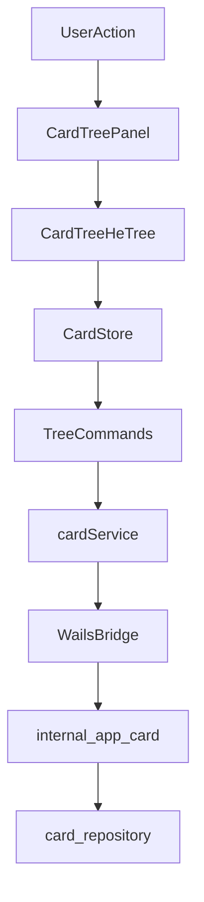

# 基于 he-tree 的 Card Tree 实现方案

## 1. 目标与设计原则

本方案目标是在 `desktop/frontend/src/features/card-tree` 下引入 Vue 社区常用树形交互能力（he-tree），实现接近 SuperMemo 的卡片树栏体验，并保持以下原则：

- 高可读性：组件职责单一，状态命名清晰，事件语义稳定。
- 高可扩展性：业务层不直接耦合第三方树库 API，保留替换空间。
- 高稳定性：异步请求防串扰，拖拽和排序支持 optimistic update + rollback。
- 渐进式落地：优先完成“可用树栏”，再补齐高级交互与后端接口。

目标能力范围：

- 懒加载展开/收起
- 选中联动详情
- 新建、重命名、删除
- 拖拽移动与同级重排
- 路径定位（可选增强）
- 展开状态恢复（可选增强）

## 2. 当前现状（代码基线）

### 2.1 前端 card-tree 现状

- 现有实现采用自研递归组件：
  - `CardTreePanel.vue`
  - `CardTreeNodeItem.vue`
- 状态由 Pinia `useCardStore` 管理，主要字段：
  - `rootCards`
  - `treeChildren`
  - `treeExpanded`
  - `treeLoading`
  - `treeErrors`
- 交互链路：
  - 组件事件 -> `WorkspacePage` -> `useCardStore` -> `cardService` -> `App.*`

### 2.2 he-tree 依赖现状

- 当前 `desktop/frontend/package.json` 未引入 he-tree 依赖。
- 需要新增 he-tree 包并封装为适配层组件，不直接在业务页面散落调用。

### 2.3 后端应用层现状（`internal/app`）

卡片相关（`internal/app/card.go`）已具备：

- `CreateCard`
- `GetCard`
- `GetCardDetail`
- `ListCards`
- `GetCardChildren`
- `UpdateCard`
- `DeleteCard`

知识树相关（`internal/app/knowledge.go`）已具备：

- `CreateKnowledge`
- `GetKnowledge`
- `ListKnowledge`
- `GetKnowledgeTree`
- `UpdateKnowledge`
- `DeleteKnowledge`
- `MoveKnowledge`

## 3. internal/app 接口覆盖评估

### 3.1 已满足前端树栏核心能力

- 懒加载：
  - 根节点可用 `ListCards({ knowledgeId, isRoot: true, orderBy: "sort_order" })`
  - 子节点可用 `GetCardChildren(parentId)`
- 节点增删改：
  - 创建：`CreateCard`
  - 重命名：`UpdateCard`（title）
  - 删除：`DeleteCard`
- 详情联动：
  - `GetCardDetail`

### 3.2 不满足项（必须补充）

为支持 SuperMemo 风格“拖拽移动 + 顺序持久化”，当前后端缺以下接口：

1) 卡片移动接口（跨父节点/同父移动）

- 建议名称：`MoveCard`
- 缺口原因：当前无直接更新 `parent_id` + 位置插入的应用层能力。

2) 同级排序持久化接口（批量重排）

- 建议名称：`ReorderCardChildren` 或 `BatchUpdateCardSortOrder`
- 缺口原因：虽有 `sort_order` 字段和按此排序查询，但无写入入口。

### 3.3 建议增强项（中期）

1) 路径查询接口

- 建议名称：`GetCardPath`
- 用于搜索命中后自动展开祖先链和定位节点。

2) 视图状态持久化接口（可选）

- 建议名称：`SaveTreeViewState` / `LoadTreeViewState`
- 用于跨会话恢复展开态与选中态（可先本地存储，再升级后端存储）。

## 4. 前端架构设计（he-tree 适配）

## 4.1 目录与组件拆分

建议将 `card-tree` 重构为：

- `CardTreePanel.vue`：容器层，工具栏、状态提示、事件汇总。
- `CardTreeHeTree.vue`：he-tree 适配层，负责树组件绑定与 DnD 事件转换。
- `CardTreeNodeContent.vue`：节点内容渲染层，负责标题、icon、meta、内联编辑入口。
- `composables/useCardTreeCommands.ts`：封装 create/rename/delete/move/reorder 命令。
- `types/cardTree.ts`：树视图模型与事件类型定义。

### 4.2 状态模型（Pinia）

建议用“规范化状态”替代深层递归状态，降低复杂度与重渲染成本：

- `nodesById: Record<string, CardTreeNodeVM>`
- `childrenByParentId: Record<string, string[]>`
- `uiStateById: Record<string, NodeUIState>`
- `rootNodeIds: string[]`

其中 `NodeUIState` 建议包含：

- `expanded`
- `loadingChildren`
- `childrenLoaded`
- `error`
- `editing`
- `selected`

`CardTreeNodeVM` 与后端 DTO 解耦，新增前端字段：

- `hasChildrenHint`（后续可由后端直接给出）
- `depth`
- `draggable`
- `droppable`

### 4.3 数据流与事件流



事件命名规范（可读性）：

- `onNodeExpand`
- `onNodeCollapse`
- `onNodeSelect`
- `onNodeRename`
- `onNodeCreateChild`
- `onNodeDelete`
- `onNodeDrop`

### 4.4 he-tree 使用约束（最佳实践）

- 只在 `CardTreeHeTree.vue` 内直接引用 he-tree API。
- 对外暴露稳定业务事件，不透出第三方事件对象。
- 拖拽完成后先本地重排（optimistic），再调用后端；失败时回滚并 toast 提示。
- 节点渲染纯展示化，业务逻辑进入 store/composable。

## 5. 前后端接口设计（补充项）

## 5.1 MoveCard

请求：

```ts
interface MoveCardRequest {
  cardId: string;
  targetParentId: string | null;
  targetIndex: number;
}
```

返回：

```ts
interface MoveCardResponse {
  cardId: string;
  sourceParentId: string | null;
  targetParentId: string | null;
  targetIndex: number;
}
```

语义：

- 支持跨父节点移动与同父重排。
- 服务端确保：
  - 防环（不能移动到自身后代）
  - 原父和目标父下 `sort_order` 连续重排
  - 事务一致性

## 5.2 ReorderCardChildren

请求：

```ts
interface ReorderCardChildrenRequest {
  parentId: string | null;
  orderedChildIds: string[];
}
```

返回：

```ts
interface ReorderCardChildrenResponse {
  parentId: string | null;
  affectedCount: number;
}
```

语义：

- 用于同级批量排序，幂等。
- 当 `orderedChildIds` 与当前顺序一致时快速返回。

## 5.3 GetCardPath（增强）

请求：

```ts
interface GetCardPathRequest {
  cardId: string;
}
```

返回：

```ts
interface CardPathNode {
  id: string;
  parentId: string | null;
  title: string;
}

interface GetCardPathResponse {
  nodes: CardPathNode[]; // root -> target
}
```

语义：

- 支持树内定位、面包屑展示、搜索结果跳转后自动展开链路。

## 6. 前端实现步骤（分阶段）

### Phase 1：he-tree 接入与只读迁移

- 新增 `CardTreeHeTree.vue` 适配层。
- 用 he-tree 渲染根节点与已加载子节点。
- 保持现有 `loadRootCards` / `expandTreeNode` API 调用不变。
- 保持选中行为与当前详情联动兼容。

交付标准：

- 与现有树栏功能等价（展示、展开、重试、选中）。

### Phase 2：树命令化（增删改）

- 新增 `useCardTreeCommands.ts`。
- 实现 create / rename / delete 命令化入口。
- 在 `cardService` 增加 `updateCard`、`deleteCard` 封装（若尚未暴露）。

交付标准：

- 节点操作统一通过命令层触发，便于快捷键与右键菜单复用。

### Phase 3：拖拽移动与排序持久化

- 接入 he-tree DnD 回调。
- 前端执行 optimistic 本地重排。
- 调用 `MoveCard` 或 `ReorderCardChildren` 持久化。
- 失败自动回滚并提示。

交付标准：

- 可稳定完成跨父移动、同级重排，顺序刷新后一致。

### Phase 4：体验增强

- `GetCardPath` + 搜索定位展开链路。
- 键盘导航（上下选择、左右展开收起、Enter 打开）。
- 展开态持久化（先 localStorage，再可迁移后端）。

交付标准：

- 树操作效率接近 SuperMemo 的高频使用体验。

## 7. 风险与对策

- 拖拽并发冲突（多次快速拖动）：
  - 对策：同一父节点重排请求串行化；后写覆盖前写。
- 懒加载与重排状态冲突：
  - 对策：`childrenLoaded` 与 `loadingChildren` 明确区分，回滚时仅恢复受影响分支。
- 树规模变大后的渲染压力：
  - 对策：预留虚拟列表能力，避免一次性渲染整棵树。
- 第三方库升级风险：
  - 对策：限制 he-tree 使用边界在单一适配组件。

## 8. 代码规范与可维护性要求

- 统一 TypeScript 类型入口：
  - `types/dto.ts`（后端协议）
  - `features/card-tree/types/cardTree.ts`（前端视图模型）
- 组件只关心展示与事件，不直接写服务调用。
- Store 只做状态编排，不承载复杂 UI 规则（规则进入 composable 命令层）。
- 错误处理统一：`domainError -> userMessage` 映射，避免散落硬编码。

## 9. 最小接口清单（实现本方案必需）

前端（bridge）需至少具备：

- `listCards`
- `getCardChildren`
- `createCard`
- `updateCard`
- `deleteCard`
- `moveCard`（新增）
- `reorderCardChildren`（新增）

后端（`internal/app`）需新增：

- `MoveCard`
- `ReorderCardChildren`

可选新增：

- `GetCardPath`
- `SaveTreeViewState` / `LoadTreeViewState`

---

该方案可在不破坏现有页面结构的前提下渐进升级，优先复用已有查询能力，集中补齐“移动与排序”两个关键后端接口后即可落地 SuperMemo 风格卡片树的核心交互。
